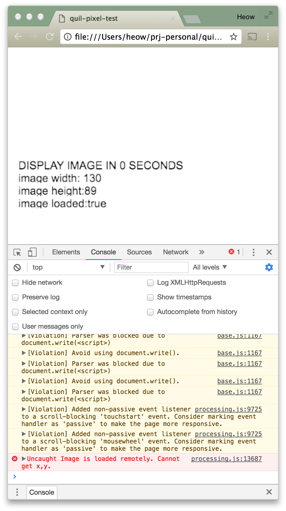
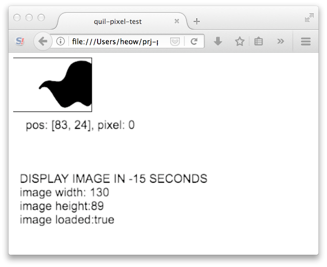

# quil-pixel-test

A Quil sketch designed to highlight running Quil in a browser from the local filesystem.  In particular the issue of getting pixel values at runtime.  

It works great as an Applet or remote HTML/JS but exhibits unspecified behavior based on browser.  To actually run Quil "locally", you need to use a self-hosted web server.

| BROWSER         | LOCAL    |
|-----------------|----------|
| Applet          | ok       |
| OSX Chrome 60   | **FAIL** |
| OSX Firefox 55  | ok       |
| OSX Vivaldi 1.3 | **FAIL** |
| Safari 9.1.3    | ok       |

## Remote Test

[Simply click here](http://45.55.82.27/quil-pixel-test/) and in 5 seconds you will or will not see an image.

## Local Test

1. [Unzip this file](https://github.com/heow/quil-pixel-test/blob/master/local-test.zip?raw=true)
2. Open the index.html with a browser
3. report your findings to me

## Example Screenshots

### Failure


### Success


## Build it Yourself

```
  $ ./cljs-autobuild.sh
```

Open [index.html](index.html) in all the browsers.
